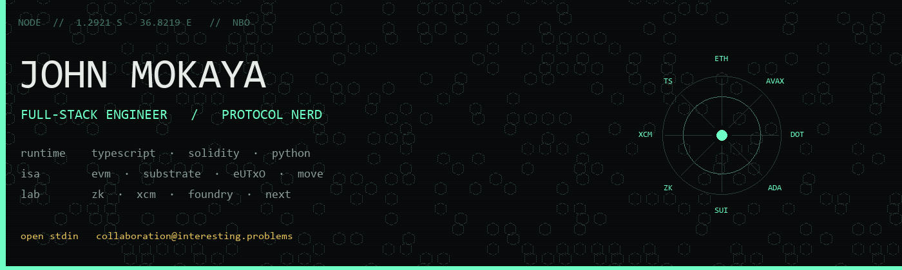
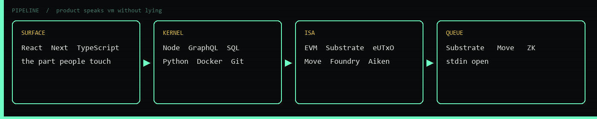
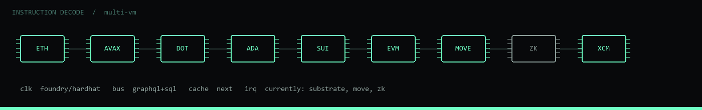

  

  

  
  
  
  
  

---

I write the boring path: a typed UI, a stubborn API, a schema that survives Tuesday, and a contract that does not invent a new religion. Nairobi is the node. The interesting part is the **seam** — where a product has to speak a virtual machine without lying to either side.

The queue on the bench is Substrate, Move, and zero-knowledge. Same shop, harder machines.

  

  

| layer | what it is |
| --- | --- |
| **EVM** | Solidity, ERC-20 / 721 / 1155, Uniswap V3 / V4, Hardhat, Foundry, Web3.js. Events are receipts. Gas is a product constraint. |
| **Avalanche** | C-Chain for EVM muscle. Subnets when the room has to be yours. |
| **Polkadot** | Substrate pallets, parachains, XCM. The runtime is the program. |
| **Cardano** | Aiken, eUTxO, Plutus. Datum is state. Redeemer is the argument. |
| **Sui** | Move objects, zkLogin, sponsored txns. Mutation stays explicit. |

---

  

  
  
  
  
  
  
  
  
  
  

---

  
  

  

  

  <picture>
    <source media="(prefers-color-scheme: dark)" srcset="https://raw.githubusercontent.com/mokayaj857/mokayaj857/output/github-contribution-grid-snake-dark.svg" />
    <source media="(prefers-color-scheme: light)" srcset="https://raw.githubusercontent.com/mokayaj857/mokayaj857/output/github-contribution-grid-snake.svg" />
    
  </picture>

  

