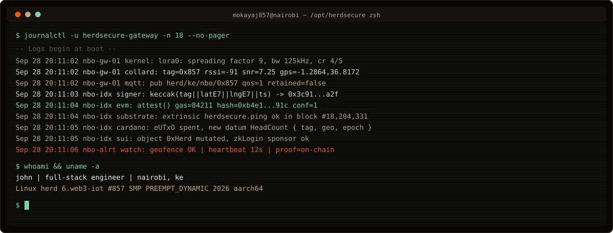
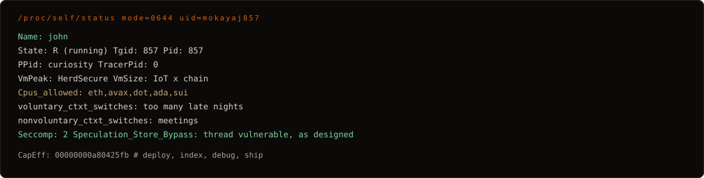
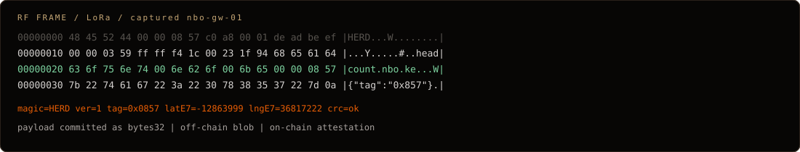
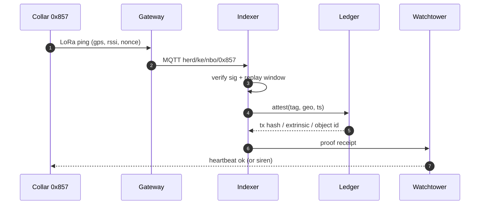
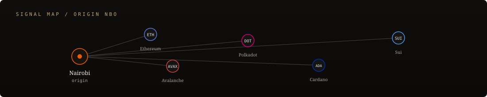
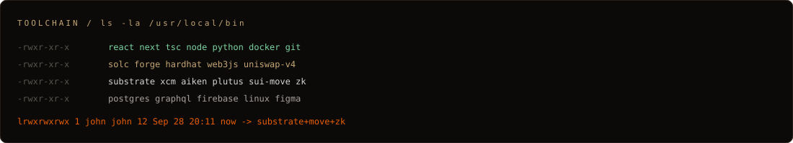

```
mokayaj857@nairobi
------------------
os:       full-stack / web3
host:     HerdSecure
kernel:   typescript + solidity
packages: eth avax dot ada sui
shell:    foundry  |  hardhat  |  next
wm:       nairobi, ke
uptime:   compiling since the first collar
cpu:      curiosity
gpu:      zk proofs (warming up)
```

<p align="center">
  <a href="https://readme-typing-svg.demolab.com">
    
  </a>
</p>

<p align="center">
  <a href="mailto:mokayaj857@gmail.com"></a>
  <a href="https://linkedin.com/in/john-mokaya-3b926a261"></a>
  <a href="https://john-mokaya.vercel.app/"></a>
  <a href="https://github.com/mokayaj857"></a>
  
</p>



---

### `man john`

A stolen cow is usually gossip. Gossip does not survive a hash.

I design full-stack systems with a Web3 core, then I actually ship them. The flagship is **[HerdSecure](https://john-mokaya.vercel.app/)**: collars on livestock, LoRa in the bush, an indexer that is picky about signatures, and an attestation that lands on a ledger. If the animal moves, the chain is supposed to know. If it does not, that is a bug, not a vibe.

Nairobi is the lab. The stack is whatever gets a packet from a neck to a block without lying.





---

### packet path

```
  [ collar / GPS / IMU ]
           |  LoRaWAN  sf9  125kHz
           v
     [ gateway nbo-gw-01 ]
           |  MQTT  herd/ke/+/+
           v
     [ indexer + signer ]
           |  keccak(tag || latE7 || lngE7 || ts)
           v
   +-------+--------+---------+--------+
   |  EVM  |  DOT   |  eUTxO  |  Move  |
   |  AVAX |  XCM   |  Aiken  |  Sui   |
   +-------+--------+---------+--------+
           |
           v
     [ watchtower ]
       geofence · heartbeat · alert
```



---

### `$ cat contracts/HeadCount.sol`

```solidity
// SPDX-License-Identifier: MIT
pragma solidity ^0.8.24;

interface IHerd {
    event HeadCount(
        bytes32 indexed herd,
        uint256 indexed tag,
        int32 latE7,
        int32 lngE7,
        uint64 ts
    );

    function attest(
        bytes32 herd,
        uint256 tag,
        int32 latE7,
        int32 lngE7,
        uint64 ts,
        bytes calldata sig
    ) external;
}
```

```move
module herd::secure {
    struct Collar has key { tag: u64, lat_e7: i32, lng_e7: i32, ts: u64 }
    public fun ping(c: &mut Collar, lat: i32, lng: i32, ts: u64) {
        c.lat_e7 = lat; c.lng_e7 = lng; c.ts = ts;
    }
}
```

```aiken
pub type Datum { HeadCount { tag: ByteArray, geo: ByteArray, epoch: Int } }
```



<details>
<summary><b>chain notes (click)</b> — the stuff behind the logos</summary>

**Ethereum / EVM** — Solidity, ERC-20 / 721 / 1155, Uniswap V3 / V4 pools, Hardhat, Foundry, Web3.js. Attestations as cheap events + calldata, not a novel L1 religion.

**Avalanche** — C-Chain contracts, subnets when isolation is the point, bridges when it is not.

**Polkadot** — Substrate, parachains, XCM. Herd state as a runtime pallet is the long game, not a tweet.

**Cardano** — Aiken, eUTxO, Plutus / Marlowe. Datum is the animal. Redeemer is the proof the collar still exists.

**Sui** — Move object model, zkLogin, sponsored txns. A collar is an object. A ping mutates it. A sponsor pays the farmer's gas.

**Currently in the lab** — Substrate internals, Move resource safety, ZK proofs. Learning in public, breaking things on purpose.

</details>

---

### `$ ls /usr/local/bin`



<div align="center">

**userspace**


**kernel-adjacent**


</div>

---

### `$ git log --stat`

<div align="center">
  
  
  <br/>
  
</div>

<br/>


<div align="center">
  <picture>
    <source media="(prefers-color-scheme: dark)" srcset="https://raw.githubusercontent.com/mokayaj857/mokayaj857/output/github-contribution-grid-snake-dark.svg" />
    <source media="(prefers-color-scheme: light)" srcset="https://raw.githubusercontent.com/mokayaj857/mokayaj857/output/github-contribution-grid-snake.svg" />
    
  </picture>
</div>

<div align="center">
  
</div>

---

### `$ crontab -l`

```cron
# m h  dom mon dow  command
  0 *  *   *   *   ping collar || page watchtower
  @reboot          compile contracts && index heads
  0 2  *   *   *   study substrate / move / zk
  * *  *   *   *   be open to weird, serious collaboration
```

<p align="center">
  <a href="https://ko-fi.com/V7V4RAK9C"></a>
</p>

```
     ^__^                    48 45 52 44
     (oo)\_______            tag 0x0857
     (__)\       )\/\        lat -1.286389
         ||----w |           lng  36.817223
         ||     ||           proof != rumour
```


